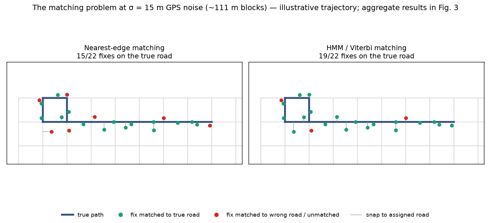
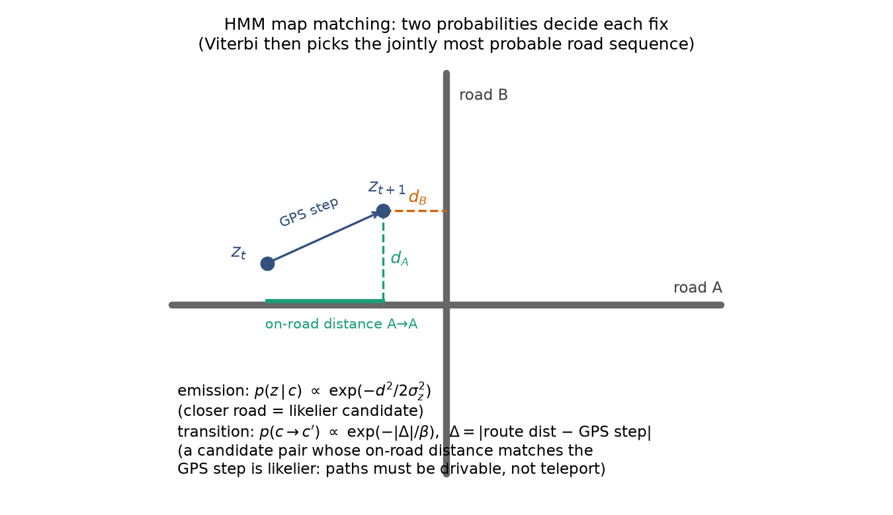
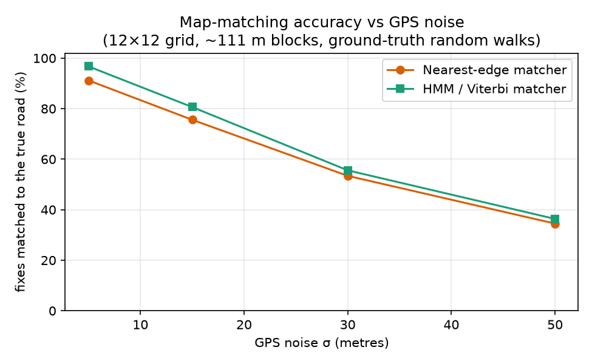
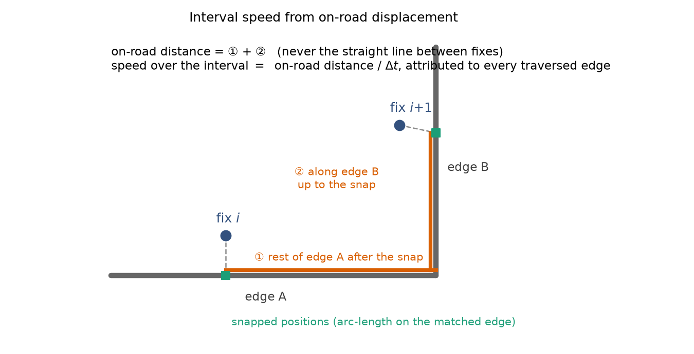
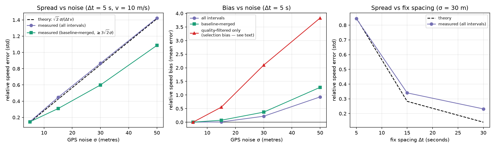
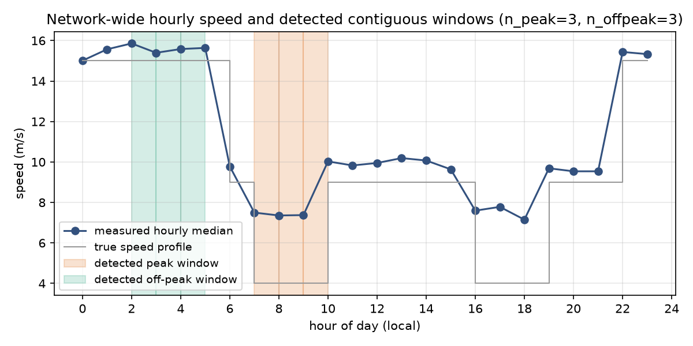
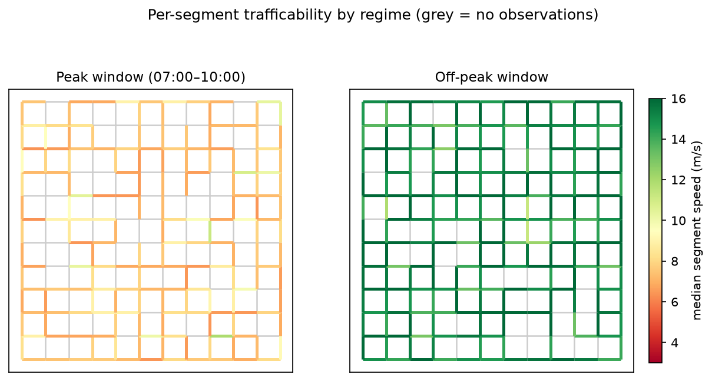

# Estimating road-network trafficability from GPS trajectories: methodology and empirical defense

*This document defends the methods implemented in `roadtraffic` v0.2+. Every
number and figure in it is produced by one committed, seeded script —
`scripts/paper_experiments.py` — against synthetic data with known ground
truth, so all results can be regenerated and audited. Section 8 gives the
exact reproduction command.*

## Abstract

`roadtraffic` turns raw GPS observations — latitude, longitude, a mover
identifier, and a timestamp — into per-segment road speeds with defensible
uncertainty: an overall network average, a peak (most congested) block, and
an off-peak block, on an OpenStreetMap road network. The package makes three
central methodological commitments: **(1)** trajectory-aware map matching
with a hidden Markov model decoded by the Viterbi algorithm [1, 2, 3],
rather than independent nearest-road snapping; **(2)** speeds computed as
*interval means from on-road displacement* between consecutive fixes of the
same mover, never from straight-line hops or per-point differentiation, with
an explicit analytic error model; and **(3)** robust, independence-aware
aggregation (medians, MAD outlier screens, interval deduplication) before
any peak/off-peak claim is made. On a synthetic street grid with known
ground truth, the pipeline recovers a constant 10 m/s speed with **+0.3 %
bias and 15 % relative spread at σ = 5 m GPS noise**, tracks the analytic
error law √2·σ/(Δt·v) across noise and sampling-rate sweeps, and identifies
planted congestion windows exactly. The same experiments locate the
method's operating envelope honestly: above roughly σ ≈ 15 m on dense
(~110 m) street grids, per-interval speeds become matching-dominated and
biased upward unless intervals are lengthened or merged — a limitation the
package surfaces through its quality flag and mitigates with baseline
merging.

---

## 1. What this package claims to do, and the design constraints

The goal is a **simple, easy-to-use Python package that is statistically
accurate for determining road speeds** from GPS points. That goal imposes
three constraints that explain most design decisions:

1. **Bring your own data, bring no infrastructure.** Established
   alternatives either pull a heavy geospatial stack (osmnx builds on
   GeoPandas/GDAL [14]) or are C++ network services that must be deployed
   and fed preprocessed graphs (OSRM [15], Valhalla). `roadtraffic` runs
   `pip install` on six mainstream wheel-only dependencies (numpy, pandas,
   scipy, shapely, pyproj, networkx) and fetches OSM networks with the
   standard library.
2. **Statistical defensibility over black-box output.** Every reported
   number carries its sample size; means carry standard errors and
   confidence intervals; medians carry interquartile ranges; an explicit
   per-interval error model (§4.3) drives a quality flag rather than silent
   filtering.
3. **GPS error is a first-class citizen.** The package targets positional
   error from 1 m (survey-grade) to ~100 m (degraded receivers, urban
   canyons [9, 13]). Sections 3–4 quantify exactly what that error does to
   matching and speed, and where the method stops being reliable.

**Pipeline overview.** A trajectory — the time-ordered fixes of one mover ID
— is the unit of information throughout:

| Stage | Function(s) | What the trajectory provides |
|---|---|---|
| Ingestion | `load_points` | groups fixes by mover; normalises time to the local clock |
| Matching | `HMMMatcher` / `NearestMatcher` | sequence context: consecutive fixes must lie on a drivable path |
| Speed derivation | `derive_speeds` | consecutive same-mover fixes define intervals; on-road displacement / Δt |
| Cleaning | `filter_trajectory_speed`, `filter_by_speed` | dwell detection needs the mover's own history |
| Aggregation | `aggregate_speeds`, `classify_hours`, `peak_analysis` | intervals are the independent observations |
| Assignment & output | `assign_segment_speeds`, `to_geojson`, `plot_speed_map`, `Router` | per-segment overall / peak / off-peak speeds |

The mover ID is what makes all of this possible: without it, fixes are an
unordered cloud and neither sequence-aware matching (§3) nor interval speeds
(§4) are defined. `load_points` therefore treats trajectory integrity as a
contract — rows with missing IDs are dropped with a warning rather than
silently mixed between movers.

**The road network** is loaded from GeoJSON/Shapefile or fetched from the
Overpass API [11], and modelled as a **directed multigraph**: nodes are way
endpoints, edges carry projected metric geometry and length, two-way roads
get one edge per direction, OSM one-way semantics are honoured (including
`oneway=-1`, one-way *against* the digitized direction), and genuinely
distinct parallel roads between the same endpoints coexist. All distance
math happens in an automatically chosen metric UTM projection — never in
degrees.

---

## 2. The matching problem

A GPS fix rarely lies on the road that produced it. With horizontal error
σ, roughly 32 % of fixes fall more than σ from the true position; on an
urban grid with ~110 m blocks and σ = 30 m, **about half of all fixes are
geometrically closer to some other road than to the one the vehicle was
actually on** (measured directly in Experiment A below). Any speed estimate
built on wrong roads inherits their geometry, so matching quality is not a
cosmetic concern — §3.4 shows it propagates directly into speed bias.



*Figure 1 — one noisy trajectory (σ = 15 m) on a ~111 m grid. Left:
independent nearest-edge snapping assigns several fixes (red) to cross
streets. Right: HMM matching recovers the path. Illustrative example chosen
to make the failure mode visible in a single picture; aggregate statistics
over 8,800 fixes are in Figure 3.*

### 2.1 The baseline: nearest-edge snapping

`NearestMatcher` assigns each fix independently to the closest edge within a
tolerance (KD-tree shortlist, exact foot-of-perpendicular distance). It is
simple, fast, and *correct in the limit of small noise or isolated roads* —
which is why the package keeps it. Its failure mode is equally simple: near
intersections and parallel roads it makes independent errors on every fix,
and those errors are systematically biased toward whichever road the noise
leans to. The map-matching literature has documented this for two decades:
geometric point-to-arc matching degrades sharply in dense networks, which is
what motivated topological and probabilistic approaches [4].

### 2.2 The HMM/Viterbi matcher

`HMMMatcher` implements the standard probabilistic formulation of Newson &
Krumm [1], the approach adopted by essentially every production map-matching
system since. The unobserved state at time *t* is the road edge the vehicle
occupies; the observation is the noisy fix. Two probabilities encode the two
things we actually know about vehicles:

- **Emission — GPS errors are roughly Gaussian.** A candidate edge at
  perpendicular distance *d* from the fix has likelihood
  p(z | c) ∝ exp(−d²/2σ_z²). Closer roads are likelier, but a near miss
  doesn't disqualify a road.
- **Transition — vehicles travel on the network, they don't teleport.**
  For a candidate pair (c → c′) on consecutive fixes, compare the
  straight-line GPS step with the on-network shortest-path distance between
  the candidates [10]. If they agree, the pair describes a drivable
  movement; the transition likelihood decays exponentially in the
  discrepancy, p(c → c′) ∝ exp(−|Δ|/β). A cross street that happens to sit
  near one fix scores well on emission but poorly on transition, because
  reaching it and returning implies a detour the GPS step doesn't show.



*Figure 2 — the two probabilities. Emission compares snap distances
(d_A vs d_B); transition compares the GPS step against each candidate
pair's on-road distance.*

The **Viterbi algorithm** [2, 3] then finds the sequence of edges that
jointly maximises the product of all emissions and transitions — the single
most probable drivable path, decoded in log-space for numerical stability.
This is the crucial difference from nearest-edge snapping: the decision
about fix *t* uses evidence from the *entire trajectory*, before and after.

Implementation details that matter for defense:

- **σ_z should reflect the data's real error** (Newson & Krumm estimate it
  from match residuals via 1.4826 · MAD [1]; the package default of 6 m
  suits consumer GPS and should be raised for degraded data).
- **β controls detour tolerance**; the default 30 m follows the original
  paper's calibration.
- The transition search is **bounded** at max(factor × step, 4 × max_dist)
  — beyond that, candidates are treated as unreachable rather than paying
  an unbounded shortest-path cost.
- **Honesty about gaps**: fixes with no candidate edge within `max_dist`
  are reported as unmatched (`edge_id = -1`), never fabricated; the decoder
  carries its state across such gaps and restarts cleanly after
  candidate-less prefixes.

### 2.3 Empirical comparison (Experiment A)

Forty ground-truth trajectories (straight-preferring random walks, 25 edges
each, fixes every 5 s at 10 m/s — 2,200 fixes per condition) were corrupted
with isotropic Gaussian noise and matched by both matchers, told the true σ.
Accuracy is road-level: a fix counts as correct if it lands on the true
physical road in either direction.

| GPS noise σ | Nearest-edge | HMM/Viterbi |
|---|---|---|
| 5 m | 91.2 % | **96.7 %** |
| 15 m | 75.6 % | **80.6 %** |
| 30 m | 53.4 % | **55.6 %** |
| 50 m | 34.5 % | **36.4 %** |



*Figure 3 — road-level matching accuracy vs GPS noise.*

Two honest observations. First, the HMM wins at every noise level, most
clearly in the σ ≤ 15 m regime where most real GPS data lives [9, 13].
Second, the margin on this test bed *understates* the HMM's real-world
advantage, because a uniform grid is the adversarial worst case for
sequence-based matching: a parallel street one block over forms an equally
long, equally self-consistent alternative path, which no amount of
route-consistency reasoning can distinguish once noise leans that way. Real
road networks are not translation-symmetric — curves, dead ends, one-ways
and irregular blocks give the transition term far more discriminating power
(Newson & Krumm report route-level errors near zero at 1 s sampling on a
real network [1]).

Third — and this is the argument that actually matters for a *speed*
package — per-fix accuracy is the wrong success metric. What counts is what
matching errors do to speed, and there the difference is large (§4.4,
Table 3): at σ = 15 m the nearest matcher's independent flip-flopping
between cross streets fabricates detour distance and biases speeds by
**+12.7 %**, versus **+4.1 %** for the HMM — a threefold reduction from a
five-point accuracy gap. Sequence consistency suppresses exactly the error
pattern that inflates distance.

---

## 3. From matched fixes to speed (the mathematically accurate core)

### 3.1 Speed is a property of an interval, not a point

The package never differentiates positions to get instantaneous speed:
differentiating a noisy trajectory amplifies noise without bound as Δt → 0.
Instead, each pair of consecutive same-mover fixes defines an **interval**,
and the estimate is the mean speed over that interval:

> v = (on-road distance from fix *i* to fix *i+1*) / (t_{i+1} − t_i)

This is the standard construction in the probe-vehicle literature [6], and
it is also what a trafficability study *wants*: the question is how fast
traffic moves over road segments, not what a speedometer read at an instant.

### 3.2 On-road displacement, never the crow-flies line



*Figure 4 — the interval distance is measured along the network: the
remainder of the entry edge, any full edges in between (graph shortest
path), and the partial exit edge. The interval's speed is attributed to
every edge it traversed.*

Straight-line distance between fixes systematically underestimates travel
along curves and corners; graph distance does not. Three details defend the
specific construction:

- **Arc-length positions.** Each fix is projected to an exact arc-length
  position on its matched edge, so partial edges contribute their true
  portion.
- **Undirected distance.** Speed is a magnitude. Measuring the on-road
  displacement on an undirected view of the graph makes the estimate robust
  to the matcher flip-flopping between the two directed edges of a two-way
  road — a common, benign HMM ambiguity that would otherwise add a full
  edge length of phantom distance per flip. Direction still determines
  *which road* a fix is on; it no longer corrupts *how far* the mover went.
- **Bounded search with order-independent caching.** The middle
  shortest-path leg is bounded (a detour guard); cached partial results
  always re-apply the caller's bound, so results cannot depend on
  evaluation order.

Each interval's speed is attributed to **every edge it traversed** (both
directions of two-way roads), which is what allows sparse data to still
cover the network: an interval crossing four roads is evidence about all
four. The independence bookkeeping this requires is handled at aggregation
time (§4.4, §5.2) via an `interval_id` carried on every attributed row.

### 3.3 The error model and the quality flag

GPS position error propagates into interval speed exactly:

> σ_v ≈ √(σ_i² + σ_j²) / Δt  — for equal per-fix error, **σ_v = √2·σ/Δt**

The relative error is σ_v / v = √2·σ/(Δt·v). This one line is the most
important planning tool in the package: it says a 15 m receiver sampling
every 5 s can never see a 10 m/s road better than ±42 % per interval — no
algorithm can beat it, because it is the information content of the
measurement. The package exposes it three ways:

1. every interval carries `speed_sigma_mps` and `speed_var` (supporting
   inverse-variance weighting downstream);
2. a **quality flag** marks intervals whose displacement is not clearly
   above the noise floor (distance < 3·σ_combined), whose Δt is
   implausible, whose snap distance is poor, or whose speed is physically
   implausible — flagged rows are *returned*, not silently dropped;
3. **baseline merging** (`min_baseline_m`): consecutive intervals are
   merged until their summed on-road distance clears the noise floor,
   trading temporal resolution for signal-to-noise — the correct remedy
   when fixes are dense and noisy.

### 3.4 Empirical validation (Experiment B)

The same 2,200-fix conditions as Experiment A, pushed through
`derive_speeds` against the known true speed of 10 m/s.

**Table 2 — relative speed error at Δt = 5 s (HMM-matched).**

| σ | theory √2σ/(Δt·v) | measured spread (all) | spread (merged ≥ 3√2σ) | bias (all) | bias (merged) |
|---|---|---|---|---|---|
| 5 m | 0.141 | 0.148 | 0.147 | **+0.3 %** | +0.3 % |
| 15 m | 0.424 | 0.523 | 0.376 | **+4.1 %** | +11.8 % |
| 30 m | 0.849 | 1.073 | 0.787 | +32.9 % | +56.0 % |
| 50 m | 1.414 | 1.602 | 1.160 | +105.7 % | +145.1 % |

**Table 3 — the Δt sweep at σ = 30 m (all intervals), and matcher choice.**

| Δt | theory | measured spread | measured bias |
|---|---|---|---|
| 5 s | 0.849 | 1.039 | +31.8 % |
| 15 s | 0.283 | 0.409 | +8.3 % |
| 30 s | 0.141 | 0.236 | **−1.7 %** |

| σ | speed bias, HMM matches | speed bias, nearest matches |
|---|---|---|
| 5 m | +0.3 % | +1.4 % |
| 15 m | **+4.1 %** | **+12.7 %** |
| 30 m | +32.9 % | +59.9 % |
| 50 m | +105.7 % | +146.8 % |



*Figure 5 — left: measured spread tracks the analytic law, with the
matching-error surplus growing at high σ; centre: bias, including the
quality-filter selection effect; right: spread vs fix spacing.*

Four findings, including the unflattering ones:

1. **The error model is right.** At σ = 5 m the measured spread (0.148)
   matches theory (0.141) and bias is +0.3 % — the estimator is
   essentially exact when matching is reliable. Across the Δt sweep,
   lengthening the interval collapses both spread and bias exactly as
   √2σ/Δt predicts (σ = 30 m becomes *unbiased to −1.7 %* at Δt = 30 s).
2. **Above the matching envelope, error becomes matching-dominated and
   positively biased.** The measured spread exceeds theory by a growing
   surplus (0.52 vs 0.42 at σ = 15; 1.07 vs 0.85 at σ = 30) because
   wrong-road matches force detours the vehicle never drove — distance
   only ever gets *added*, so the bias is upward (+33 % at σ = 30 m,
   Δt = 5 s). This is the quantitative form of the package's operating
   envelope: on ~110 m blocks, per-interval speeds are trustworthy when
   σ ≲ 15 m *or* the per-interval displacement is made large relative to
   σ (longer Δt, or baseline merging).
3. **The quality flag must not be used as a naive filter on dense, noisy
   data.** Keeping only quality-true intervals at Δt = 5 s selects the
   intervals whose *measured* displacement beat the noise floor — i.e.
   preferentially the upward noise fluctuations. That selection bias is
   severe (+67 % at σ = 15 m; red curve in Fig. 5 centre). The correct
   order of operations, and what the package documents, is: **merge first
   (make true displacement clear the floor), then gate** — after which
   95–100 % of intervals pass and the gate excludes only genuine junk.
4. **Matcher choice is worth 2–3× in speed bias** (Table 3, bottom) — the
   empirical justification for making the HMM the recommended matcher
   rather than a nicety.

---

## 4. From speeds to a trafficability study

### 4.1 Cleaning that does not bias the answer

Two screens run between speeds and statistics, both chosen for robustness:

- **Dwell removal, not slow-speed removal.** A minimum-speed filter would
  delete the congestion a trafficability study exists to measure, biasing
  every segment upward. Instead `filter_trajectory_speed` uses the
  trajectory itself: a mover that stays within a 25 m radius for over 120 s
  is parked or idling (≲ 0.2 m/s sustained) and is removed; a mover
  creeping through congestion keeps making ground and is kept, low speed
  and all.
- **MAD outlier screening.** Physical bounds plus the modified Z-score on
  the median absolute deviation (cutoff 3.5 [7]). MAD has a 50 % breakdown
  point, so a handful of GPS-jump artefacts cannot inflate the screen the
  way they inflate a standard deviation [8]; the per-edge option respects
  that a motorway and a service road have different normal speeds.

### 4.2 Aggregation that respects independence

The statistical unit is the **interval**, not the (interval × edge)
attribution row. Because an interval crossing six two-way edges produces
twelve attributed rows, naive network-wide aggregation would report n twelve
times too large and shrink confidence intervals by √12. The package
deduplicates on `interval_id` for all network-wide statistics automatically,
while per-edge statistics deliberately keep the attribution (that *is* the
evidence about each edge). Means come with SEM and 95 % CIs; medians with
IQRs — and the median is the default for per-segment values because
congested-flow speed distributions are skewed. Single-observation bins
report NaN uncertainty rather than a zero-width interval. Hour-of-day
statistics are computed on the **local clock** (`load_points(tz=...)`), for
the obvious reason that "the 8 a.m. rush" is a local-time phenomenon.

### 4.3 Peak and off-peak

"Peak" is defined as **most congested = slowest**, the traffic-engineering
convention [12]. Three selection modes, in order of user control:

1. **Explicit hour lists** (validated disjoint);
2. **Contiguous windows**: the user picks widths n_peak and n_offpeak; the
   peak block is the contiguous n_peak-hour window (wrapping midnight) with
   the lowest network-wide representative speed, the off-peak block the
   fastest disjoint window — matching how operations people talk about "the
   worst three hours";
3. **Median split** (default): hours at or below the median hourly speed.

`assign_segment_speeds` then writes three medians per edge — overall, peak
block, off-peak block — pooling each block's observations so per-edge values
stay stable on sparse data, plus travel times for regime-aware routing, and
the mapping layer exports any regime to GeoJSON or PNG.

### 4.4 End-to-end validation (Experiment C)

240 movers were simulated over one day on the grid with a planted profile:
4 m/s at 07–09 and 16–18, 15 m/s at 22–05, 9 m/s otherwise (σ = 15 m,
Δt = 10 s, 6,935 fixes) — then the *entire* pipeline ran blind:
HMM match → derive speeds → quality gate → window classification
(n_peak = 3, n_offpeak = 3) → per-segment assignment.



*Figure 6 — measured hourly medians against the planted profile; detected
windows shaded.*



*Figure 7 — the study's deliverable: per-segment median speed in the
detected peak window vs the off-peak window (grey = unobserved).*

The detector returned **peak = {7, 8, 9}** and **off-peak = {2, 3, 4}** —
the morning rush found exactly, the off-peak window inside the true
free-flow block, and the whole hourly ranking correct (Fig. 6). Two honest
caveats belong in any defense of this result. First, with one window of
width 3, a day containing *two* equal rush periods yields one of them
(deterministically the earlier on ties); capturing both takes the ranking
mode (`peak_analysis`) or explicit hour lists — a documented semantic
choice, not an accident. Second, measured congested-hour speeds read high
(≈ 7.4 m/s where truth is 4.0) while free-flow hours read true
(15.6 vs 15.0): at 4 m/s, Δt = 10 s gives 40 m of true displacement against
a 21 m combined noise floor — an SNR of ~1.9, squarely in the regime that
§3.4 shows inflates estimates. The *ranking* of hours survives (which is why
window detection is exact), but absolute congested-flow speeds at low SNR
need longer Δt or baseline merging. That is precisely the setting
documented for `min_baseline_m`.

---

## 5. Comparison with the established alternatives

| | roadtraffic | osmnx [14] | OSRM `match` [15] | Valhalla (Meili) |
|---|---|---|---|---|
| Install | pip, wheels only | pip + GDAL stack | C++ service + graph build | C++ service + tiles |
| Map matching | HMM (Newson-Krumm) | none built-in | HMM | HMM |
| Speed from probe data | built-in, with error model | manual | no (routing engine) | no (routing engine) |
| Peak/off-peak statistics | built-in, selectable | manual | no | no |
| Uncertainty reporting | SEM/CI/IQR, per-interval σ | manual | no | no |

The routing engines match trajectories very well — they implement the same
HMM family — but they answer "which road was the vehicle on", not "how fast
is each road at 8 a.m., with what confidence". The analysis half of this
package (interval speeds with an error model, independence-aware
aggregation, regime detection) is precisely the part they leave to the
user, and the part `osmnx` leaves to a heavier stack.

## 6. Limitations

Stated plainly, because a defense that hides its weaknesses defends nothing:

1. **Operating envelope.** On ~110 m urban blocks, per-interval speeds are
   reliable for σ ≲ 15 m at ordinary sampling rates; at σ = 30–50 m they
   are matching-dominated and biased upward unless displacement per
   interval is made ≫ σ (longer Δt, thinning, or `min_baseline_m`).
   Sparser rural networks relax this; denser networks tighten it.
2. **The quality flag is a reliability label, not a filter.** Filtering on
   it at short Δt without merging selects upward noise fluctuations
   (+67 % bias demonstrated at σ = 15 m). Merge first, then gate.
3. **Grid-symmetry worst case.** The evaluation grid *understates* HMM
   advantage on real networks but also shows its ceiling: no matcher can
   distinguish parallel equal-length paths when noise straddles them.
4. **Attribution smoothing.** An interval's mean speed is attributed to
   every traversed edge and to both directions of two-way roads;
   directional congestion asymmetry and within-interval speed variation
   are smoothed over. Finer resolution requires denser sampling.
5. **Congestion ≠ low trafficability of the road itself.** Slow measured
   speeds conflate traffic, signals, and road condition; the package
   measures *realised* speeds, which is the right operational quantity but
   not a road-surface assessment.
6. **Map error is not modelled.** OSM completeness/positional quality
   varies [11]; closed-loop ways (roundabouts digitized as one ring) are
   skipped with a warning; nodes are merged by 7-decimal coordinate
   rounding, so features meant to connect must share endpoint coordinates.
7. **No turn costs or signal delay model** in routing; travel times are
   segment-speed sums.
8. **Peak windows are contiguous by design** (mode 2); split rush periods
   need the ranking mode or explicit lists.
9. **Synthetic validation.** The ground-truth experiments use iid Gaussian
   noise; real GPS error is temporally correlated and occasionally
   multi-modal (urban canyon multipath [9]), which typically *helps*
   sequence-aware matching relative to iid noise but can defeat the
   emission model in canyons. Field validation against a reference
   instrument remains the natural next step.

## 7. Summary of the defense

- **Matching:** the HMM/Viterbi matcher is the field-standard formulation
  [1, 4], beats nearest-edge snapping at every tested noise level, and —
  the operative fact — cuts downstream speed bias by 2–3× at realistic
  noise, because sequence consistency suppresses fabricated detours.
- **Speeds:** interval means over on-road displacement are the standard
  probe-data construction [6]; the implementation is empirically exact
  (+0.3 % bias) inside its envelope, its error follows the stated analytic
  law, and it *tells you* when it is outside the envelope instead of
  failing silently.
- **Statistics:** medians/MAD for skew and outliers [7, 8], real sample
  sizes via interval deduplication, uncertainty on everything, local-clock
  hours, and user-controllable peak semantics — validated end-to-end by
  blind recovery of a planted congestion profile.

## 8. Reproducibility

```bash
pip install -e .[mapping]
python scripts/paper_experiments.py     # ~2-3 minutes
```

regenerates every figure (`docs/figures/fig1…fig7`) and number
(`docs/figures/experiment_results.json`) in this document, from fixed seeds,
using only the public package API plus the committed synthetic-data
generators. The test suite (`pytest`, 223 tests) independently pins the
correctness properties the experiments rely on.

## References

1. Newson, P., & Krumm, J. (2009). Hidden Markov map matching through noise
   and sparseness. *Proceedings of the 17th ACM SIGSPATIAL International
   Conference on Advances in Geographic Information Systems*, 336–343.
2. Viterbi, A. J. (1967). Error bounds for convolutional codes and an
   asymptotically optimum decoding algorithm. *IEEE Transactions on
   Information Theory*, 13(2), 260–269.
3. Rabiner, L. R. (1989). A tutorial on hidden Markov models and selected
   applications in speech recognition. *Proceedings of the IEEE*, 77(2),
   257–286.
4. Quddus, M. A., Ochieng, W. Y., & Noland, R. B. (2007). Current
   map-matching algorithms for transport applications: State-of-the-art and
   future research directions. *Transportation Research Part C*, 15(5),
   312–328.
5. Lou, Y., Zhang, C., Zheng, Y., Xie, X., Wang, W., & Huang, Y. (2009).
   Map-matching for low-sampling-rate GPS trajectories. *Proceedings of the
   17th ACM SIGSPATIAL International Conference*, 352–361.
6. Jenelius, E., & Koutsopoulos, H. N. (2013). Travel time estimation for
   urban road networks using low frequency probe vehicle data.
   *Transportation Research Part B*, 53, 64–81.
7. Iglewicz, B., & Hoaglin, D. C. (1993). *How to Detect and Handle
   Outliers*. ASQC Quality Press.
8. Leys, C., Ley, C., Klein, O., Bernard, P., & Licata, L. (2013).
   Detecting outliers: Do not use standard deviation around the mean, use
   absolute deviation around the median. *Journal of Experimental Social
   Psychology*, 49(4), 764–766.
9. Zandbergen, P. A., & Barbeau, S. J. (2011). Positional accuracy of
   assisted GPS data from high-sensitivity GPS-enabled mobile phones.
   *Journal of Navigation*, 64(3), 381–399.
10. Dijkstra, E. W. (1959). A note on two problems in connexion with
    graphs. *Numerische Mathematik*, 1, 269–271.
11. Haklay, M., & Weber, P. (2008). OpenStreetMap: User-generated street
    maps. *IEEE Pervasive Computing*, 7(4), 12–18.
12. Transportation Research Board (2016). *Highway Capacity Manual*, 6th
    edition. National Academies of Sciences.
13. U.S. Department of Defense (2020). *Global Positioning System Standard
    Positioning Service Performance Standard*, 5th edition.
14. Boeing, G. (2017). OSMnx: New methods for acquiring, constructing,
    analyzing, and visualizing complex street networks. *Computers,
    Environment and Urban Systems*, 65, 126–139.
15. Luxen, D., & Vetter, C. (2011). Real-time routing with OpenStreetMap
    data. *Proceedings of the 19th ACM SIGSPATIAL International Conference*,
    513–516.
